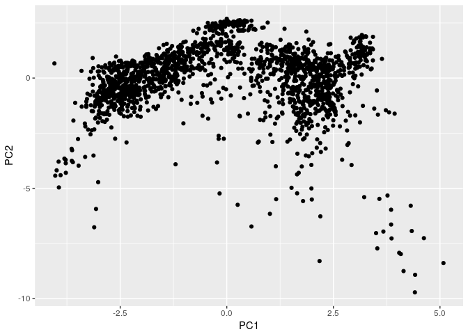
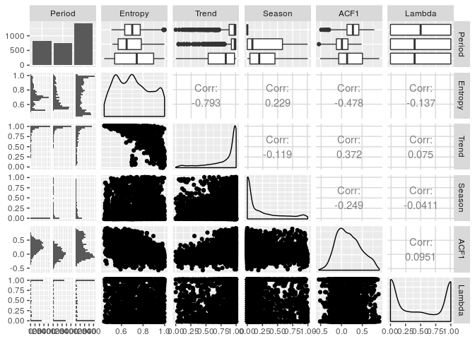
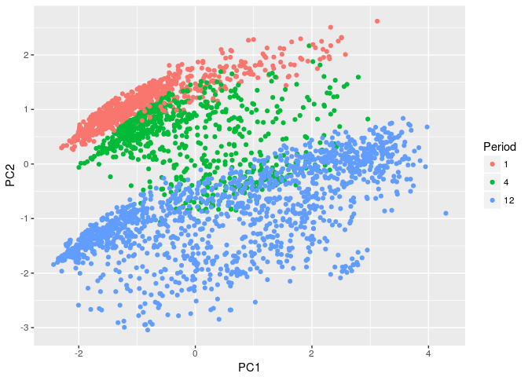
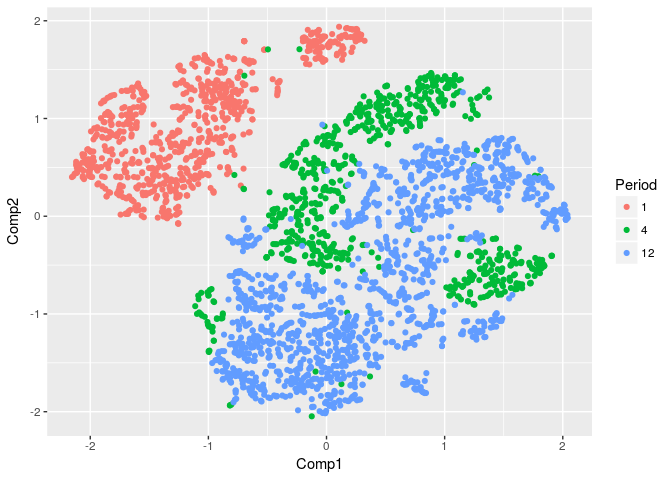

<!-- README.md is generated from README.Rmd. Please edit that file -->
tsfeatures
==========

[](https://github.com/robjhyndman/tsfeatures/pulls)

The R package *tsfeatures* provides methods for extracting various features from time series data.

Installation
------------

The **stable** version on R CRAN is coming soon.

You can install the **development** version from [Github](https://github.com/robjhyndman/tsfeatures) with:

``` r
# install.packages("devtools")
devtools::install_github("robjhyndman/tsfeatures")
```

Usage
-----

### Hyndman, Wang and Laptev (ICDM 2015)

``` r
library(tsfeatures)
library(tidyverse)
library(anomalous)

# Compute the features used in Hyndman, Wang & Laptev (ICDM 2015).
# Note that crossing_points, peak and trough are defined differently 
# in the tsfeatures package than in the Hyndman et al (2015) paper. 
# Other features are the same. Using the real data from the paper
yahoo <- cbind(dat0, dat1, dat2, dat3)
hwl <- bind_cols(
         tsfeatures(yahoo,
           c("acf1","entropy","lumpiness",
             "flat_spots","crossing_points")),
         tsfeatures(yahoo,"stl_features", s.window='periodic', robust=TRUE),
         tsfeatures(yahoo, "max_kl_shift", width=48),
         tsfeatures(yahoo,
           c("mean","var"), scale=FALSE, na.rm=TRUE),
         tsfeatures(yahoo,
           c("max_level_shift","max_var_shift"), trim=TRUE)) %>%
  select(mean, var, acf1, trend, linearity, curvature, 
         seasonal_strength, peak, trough,
         entropy, lumpiness, spike, max_level_shift, max_var_shift, flat_spots,
         crossing_points, max_kl_shift, time_kl_shift)
#> Warning in predict.lm(fit, newdata = data.frame(X)): prediction from a
#> rank-deficient fit may be misleading

#> Warning in predict.lm(fit, newdata = data.frame(X)): prediction from a
#> rank-deficient fit may be misleading

#> Warning in predict.lm(fit, newdata = data.frame(X)): prediction from a
#> rank-deficient fit may be misleading
```

``` r
# 2-d Feature space
prcomp(na.omit(hwl), scale=TRUE)$x %>% 
  as_tibble() %>%
  ggplot(aes(x=PC1, y=PC2)) +
    geom_point()
```



### Kang, Hyndman & Smith-Miles (IJF 2017)

``` r
library(tsfeatures)
library(tidyverse)
library(forecast)


# Compute the features used in Kang, Hyndman & Smith-Miles (IJF 2017).
# Note that the trend and ACF1 are computed differently for non-seasonal
# data in the tsfeatures package than in the Kang et al (2017). 
# tsfeatures uses mstl() which uses supsmu() for the trend calculation with 
# non-seasonal data, whereas Kang et al used a penalized regression spline
# computed using mgcv instead.  Other features are the same.

M3data <- purrr::map(Mcomp::M3, 
  function(x){
      tspx <- tsp(x$x)
      ts(c(x$x,x$xx), start=tspx[1], frequency=tspx[3])
  })
khs_stl <- function(x,...)
{
  lambda <- BoxCox.lambda(x, lower=0, upper=1, method='loglik')
  y <- BoxCox(x, lambda)
  c(stl_features(y,s.window='periodic', robust=TRUE, ...), lambda=lambda)
}
khs <- bind_cols(
  tsfeatures(M3data, c("frequency", "entropy")),
  tsfeatures(M3data, "khs_stl", scale=FALSE)) %>% 
  select(frequency, entropy, trend, seasonal_strength, acfremainder, lambda) %>%
  replace_na(list(seasonal_strength=0)) %>%
  rename(
    Frequency = frequency,
    Entropy = entropy,
    Trend = trend,
    Season = seasonal_strength,
    ACF1 = acfremainder,
    Lambda = lambda) %>%
  mutate(Period = as.factor(Frequency))
```

``` r
# Fig 1 of paper
khs %>% 
  select(Period, Entropy, Trend, Season, ACF1, Lambda) %>%
  GGally::ggpairs()
```



``` r

# 2-d Feature space (Top of Fig 2)
prcomp(select(khs, -Period), scale=TRUE)$x %>%
  as_tibble() %>%
  bind_cols(Period=khs$Period) %>%
  ggplot(aes(x=PC1, y=PC2)) +
    geom_point(aes(col=Period))
```



### Kang, Hyndman & Li (in preparation)

``` r
# Compute all features in MARs paper

library(tsfeatures)
library(tidyverse)
library(forecast)

M3data <- purrr::map(Mcomp::M3, 
  function(x){
      tspx <- tsp(x$x)
      ts(c(x$x,x$xx), start=tspx[1], frequency=tspx[3])
  })

nsdiffs <- function(x){
  c(nsdiffs=ifelse(frequency(x)==1L, 1L, forecast::nsdiffs(x)))
}

features1 <- c(
  "entropy",
  "stl_features",
  "acf1",
  "max_kl_shift",
  "lumpiness",
  "ndiffs",
  "nonlinearity",
  "frequency",
  "nsdiffs",
  "heterogeneity"
)
features2 <- c(  
  "max_level_shift",
  "max_var_shift"
)

yk <- bind_cols(
  tsfeatures(M3data, features1),
  tsfeatures(M3data, features2, trim=TRUE)) %>%
  replace_na(list(
    seasonal_strength=0,
    max_kl_shift=0)) %>%
  map_dfr(rank)/length(M3data)

# Retain features that have meaning for M3
yk <- select(yk,
             seasonal_period, ndiffs, nsdiffs, entropy, Nonlinearity,
               trend, spike, seasonal_strength, linearity, curvature,
               acfremainder, acf1, max_kl_shift, lumpiness,
               ARCHtest.p, GARCHtest.p, Boxtest.p, GARCHBoxtest.p,
               Hetero, max_level_shift, max_var_shift)
```

``` r
# Create distance matrix
d <- dist(yk)
# Embed to 2d using tsne
ei <- embedding(d, method="Rtsne")
```

``` r
ei %>%
  bind_cols(tsfeatures(M3data, "frequency")) %>%
  mutate(Period = as.factor(frequency)) %>%
  ggplot(aes(x=Comp1, y=Comp2)) +
  geom_point(aes(col=Period))
```


``` r
# Learn Neural net to model tsne embedding
library(caret)
df <- bind_cols(ei, yk)
nn1 <- avNNet(df[,-2],df$Comp1, repeats=10, size=5, linout=TRUE)
#> Warning: executing %dopar% sequentially: no parallel backend registered
#> Fitting Repeat 1 
#> 
#> # weights:  121
#> initial  value 3225.694439 
#> iter  10 value 61.458193
#> iter  20 value 22.287186
#> iter  30 value 10.743912
#> iter  40 value 3.410174
#> iter  50 value 1.148065
#> iter  60 value 0.274357
#> iter  70 value 0.152870
#> iter  80 value 0.104604
#> iter  90 value 0.066983
#> iter 100 value 0.051123
#> final  value 0.051123 
#> stopped after 100 iterations
#> Fitting Repeat 2 
#> 
#> # weights:  121
#> initial  value 3957.737128 
#> iter  10 value 48.186588
#> iter  20 value 8.130203
#> iter  30 value 2.494540
#> iter  40 value 0.840715
#> iter  50 value 0.345448
#> iter  60 value 0.187745
#> iter  70 value 0.082812
#> iter  80 value 0.061650
#> iter  90 value 0.044564
#> iter 100 value 0.037689
#> final  value 0.037689 
#> stopped after 100 iterations
#> Fitting Repeat 3 
#> 
#> # weights:  121
#> initial  value 3429.118021 
#> iter  10 value 34.548799
#> iter  20 value 7.110934
#> iter  30 value 2.838293
#> iter  40 value 0.956775
#> iter  50 value 0.421294
#> iter  60 value 0.251393
#> iter  70 value 0.147715
#> iter  80 value 0.105188
#> iter  90 value 0.073807
#> iter 100 value 0.051515
#> final  value 0.051515 
#> stopped after 100 iterations
#> Fitting Repeat 4 
#> 
#> # weights:  121
#> initial  value 4193.714425 
#> iter  10 value 60.143937
#> iter  20 value 11.086724
#> iter  30 value 3.014338
#> iter  40 value 1.021699
#> iter  50 value 0.367967
#> iter  60 value 0.195100
#> iter  70 value 0.109681
#> iter  80 value 0.061856
#> iter  90 value 0.044389
#> iter 100 value 0.023267
#> final  value 0.023267 
#> stopped after 100 iterations
#> Fitting Repeat 5 
#> 
#> # weights:  121
#> initial  value 3407.980655 
#> iter  10 value 75.312759
#> iter  20 value 19.309259
#> iter  30 value 6.258212
#> iter  40 value 1.867424
#> iter  50 value 0.744171
#> iter  60 value 0.296273
#> iter  70 value 0.137039
#> iter  80 value 0.095598
#> iter  90 value 0.056133
#> iter 100 value 0.030957
#> final  value 0.030957 
#> stopped after 100 iterations
#> Fitting Repeat 6 
#> 
#> # weights:  121
#> initial  value 5543.588776 
#> iter  10 value 42.890266
#> iter  20 value 4.161937
#> iter  30 value 1.416839
#> iter  40 value 0.732134
#> iter  50 value 0.449372
#> iter  60 value 0.308392
#> iter  70 value 0.219458
#> iter  80 value 0.134192
#> iter  90 value 0.097896
#> iter 100 value 0.064090
#> final  value 0.064090 
#> stopped after 100 iterations
#> Fitting Repeat 7 
#> 
#> # weights:  121
#> initial  value 2592.304297 
#> iter  10 value 331.740959
#> iter  20 value 98.123901
#> iter  30 value 28.378034
#> iter  40 value 11.901060
#> iter  50 value 2.046843
#> iter  60 value 0.592565
#> iter  70 value 0.238148
#> iter  80 value 0.110778
#> iter  90 value 0.069688
#> iter 100 value 0.051368
#> final  value 0.051368 
#> stopped after 100 iterations
#> Fitting Repeat 8 
#> 
#> # weights:  121
#> initial  value 10197.638152 
#> iter  10 value 46.573806
#> iter  20 value 6.408830
#> iter  30 value 2.435569
#> iter  40 value 0.988549
#> iter  50 value 0.571288
#> iter  60 value 0.402776
#> iter  70 value 0.299405
#> iter  80 value 0.226899
#> iter  90 value 0.151097
#> iter 100 value 0.099338
#> final  value 0.099338 
#> stopped after 100 iterations
#> Fitting Repeat 9 
#> 
#> # weights:  121
#> initial  value 3713.745511 
#> iter  10 value 405.563530
#> iter  20 value 152.689517
#> iter  30 value 61.854650
#> iter  40 value 19.783840
#> iter  50 value 10.191470
#> iter  60 value 5.843486
#> iter  70 value 3.435796
#> iter  80 value 1.888957
#> iter  90 value 1.011079
#> iter 100 value 0.531247
#> final  value 0.531247 
#> stopped after 100 iterations
#> Fitting Repeat 10 
#> 
#> # weights:  121
#> initial  value 2684.188862 
#> iter  10 value 55.847948
#> iter  20 value 13.838055
#> iter  30 value 5.069221
#> iter  40 value 2.007575
#> iter  50 value 1.033161
#> iter  60 value 0.610271
#> iter  70 value 0.283293
#> iter  80 value 0.163296
#> iter  90 value 0.116268
#> iter 100 value 0.090581
#> final  value 0.090581 
#> stopped after 100 iterations
cor(predict(nn1),df$Comp1)
#> [1] 0.9999961

nn2 <- avNNet(df[,-1],df$Comp2, repeats=10, size=5, linout=TRUE)
#> Fitting Repeat 1 
#> 
#> # weights:  121
#> initial  value 3346.276667 
#> iter  10 value 85.885573
#> iter  20 value 30.426110
#> iter  30 value 10.503619
#> iter  40 value 3.130871
#> iter  50 value 1.799719
#> iter  60 value 0.997690
#> iter  70 value 0.480400
#> iter  80 value 0.304283
#> iter  90 value 0.219302
#> iter 100 value 0.130185
#> final  value 0.130185 
#> stopped after 100 iterations
#> Fitting Repeat 2 
#> 
#> # weights:  121
#> initial  value 4816.672013 
#> iter  10 value 102.118957
#> iter  20 value 12.377357
#> iter  30 value 4.205751
#> iter  40 value 1.486056
#> iter  50 value 0.617995
#> iter  60 value 0.222216
#> iter  70 value 0.123665
#> iter  80 value 0.064503
#> iter  90 value 0.050291
#> iter 100 value 0.037025
#> final  value 0.037025 
#> stopped after 100 iterations
#> Fitting Repeat 3 
#> 
#> # weights:  121
#> initial  value 5184.034902 
#> iter  10 value 66.414518
#> iter  20 value 13.462212
#> iter  30 value 3.414091
#> iter  40 value 1.466136
#> iter  50 value 0.861294
#> iter  60 value 0.477644
#> iter  70 value 0.316440
#> iter  80 value 0.209904
#> iter  90 value 0.124085
#> iter 100 value 0.084162
#> final  value 0.084162 
#> stopped after 100 iterations
#> Fitting Repeat 4 
#> 
#> # weights:  121
#> initial  value 3441.559429 
#> iter  10 value 48.321815
#> iter  20 value 4.926927
#> iter  30 value 1.092630
#> iter  40 value 0.229669
#> iter  50 value 0.085648
#> iter  60 value 0.054243
#> iter  70 value 0.037247
#> iter  80 value 0.023545
#> iter  90 value 0.014946
#> iter 100 value 0.008973
#> final  value 0.008973 
#> stopped after 100 iterations
#> Fitting Repeat 5 
#> 
#> # weights:  121
#> initial  value 4085.693350 
#> iter  10 value 48.668339
#> iter  20 value 11.990759
#> iter  30 value 3.512269
#> iter  40 value 1.289110
#> iter  50 value 0.442029
#> iter  60 value 0.191643
#> iter  70 value 0.103263
#> iter  80 value 0.043283
#> iter  90 value 0.020589
#> iter 100 value 0.008588
#> final  value 0.008588 
#> stopped after 100 iterations
#> Fitting Repeat 6 
#> 
#> # weights:  121
#> initial  value 2502.418986 
#> iter  10 value 190.847158
#> iter  20 value 36.753850
#> iter  30 value 12.340889
#> iter  40 value 4.321767
#> iter  50 value 2.258578
#> iter  60 value 1.016682
#> iter  70 value 0.419891
#> iter  80 value 0.267670
#> iter  90 value 0.169621
#> iter 100 value 0.124782
#> final  value 0.124782 
#> stopped after 100 iterations
#> Fitting Repeat 7 
#> 
#> # weights:  121
#> initial  value 3027.134353 
#> iter  10 value 68.582923
#> iter  20 value 7.366230
#> iter  30 value 2.309939
#> iter  40 value 1.184635
#> iter  50 value 0.603965
#> iter  60 value 0.371642
#> iter  70 value 0.266038
#> iter  80 value 0.200565
#> iter  90 value 0.141202
#> iter 100 value 0.114944
#> final  value 0.114944 
#> stopped after 100 iterations
#> Fitting Repeat 8 
#> 
#> # weights:  121
#> initial  value 8329.672550 
#> iter  10 value 34.696830
#> iter  20 value 4.473567
#> iter  30 value 1.641651
#> iter  40 value 0.774529
#> iter  50 value 0.287998
#> iter  60 value 0.099495
#> iter  70 value 0.043350
#> iter  80 value 0.021245
#> iter  90 value 0.013947
#> iter 100 value 0.010563
#> final  value 0.010563 
#> stopped after 100 iterations
#> Fitting Repeat 9 
#> 
#> # weights:  121
#> initial  value 2916.041038 
#> iter  10 value 30.000699
#> iter  20 value 2.207174
#> iter  30 value 0.928579
#> iter  40 value 0.414093
#> iter  50 value 0.274673
#> iter  60 value 0.154000
#> iter  70 value 0.094129
#> iter  80 value 0.063828
#> iter  90 value 0.043165
#> iter 100 value 0.032670
#> final  value 0.032670 
#> stopped after 100 iterations
#> Fitting Repeat 10 
#> 
#> # weights:  121
#> initial  value 3214.851496 
#> iter  10 value 126.346051
#> iter  20 value 15.947892
#> iter  30 value 3.783446
#> iter  40 value 1.197326
#> iter  50 value 0.526356
#> iter  60 value 0.320510
#> iter  70 value 0.203278
#> iter  80 value 0.143579
#> iter  90 value 0.090915
#> iter 100 value 0.058141
#> final  value 0.058141 
#> stopped after 100 iterations
cor(predict(nn2),df$Comp2)
#> [1] 0.9999971

# Now plot estimated components
tibble(Comp1=predict(nn1), Comp2=predict(nn2)) %>%
  bind_cols(tsfeatures(M3data, "frequency")) %>%
  mutate(Period = as.factor(frequency)) %>%
  ggplot(aes(x=Comp1, y=Comp2)) +
  geom_point(aes(col=Period))
```



License
-------

This package is free and open source software, licensed under GPL-3.
