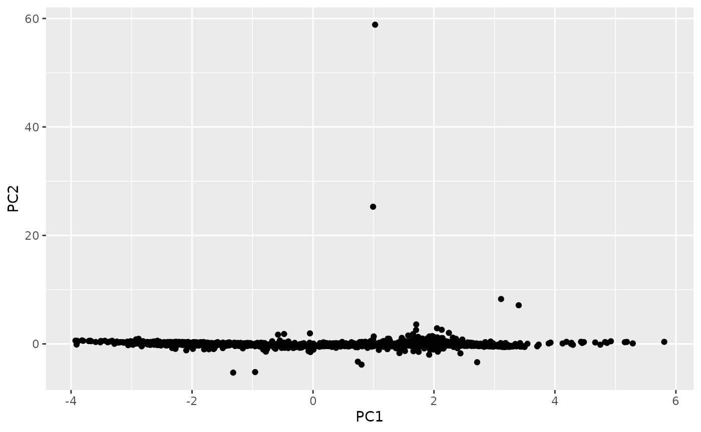
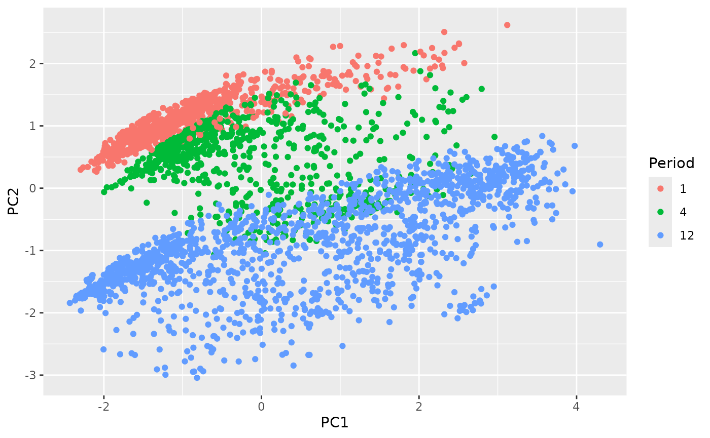

# Introduction to the tsfeatures package

## tsfeatures

The R package *tsfeatures* provides methods for extracting various
features from time series data.

### Installation

The **stable** version on R CRAN and can be installed in the usual way:

``` r
install.packages("tsfeatures")
```

You can install the **development** version from
[Github](https://github.com/robjhyndman/tsfeatures) with:

``` r
# install.packages("devtools")
devtools::install_github("robjhyndman/tsfeatures")
```

### Usage

The function
[`tsfeatures()`](http://pkg.robjhyndman.com/tsfeatures/reference/tsfeatures.md)
computes a tibble of time series features from a list of time series.

``` r
mylist <- list(sunspot.year, WWWusage, AirPassengers, USAccDeaths)
tsfeatures(mylist)
#> # A tibble: 4 × 20
#>   frequency nperiods seasonal_period trend      spike linearity curvature e_acf1
#>       <dbl>    <dbl>           <dbl> <dbl>      <dbl>     <dbl>     <dbl>  <dbl>
#> 1         1        0               1 0.125    2.10e-5      3.58      1.11  0.793
#> 2         1        0               1 0.985    3.01e-8      4.45      1.10  0.774
#> 3        12        1              12 0.991    1.46e-8     11.0       1.09  0.509
#> 4        12        1              12 0.802    9.15e-7     -2.12      2.85  0.258
#> # ℹ 12 more variables: e_acf10 <dbl>, entropy <dbl>, x_acf1 <dbl>,
#> #   x_acf10 <dbl>, diff1_acf1 <dbl>, diff1_acf10 <dbl>, diff2_acf1 <dbl>,
#> #   diff2_acf10 <dbl>, seasonal_strength <dbl>, peak <dbl>, trough <dbl>,
#> #   seas_acf1 <dbl>
```

The default functions that `tsfeatures` uses to compute features are
`frequency`, `stl_features`, `entropy` and `acf_features`. Each of them
can produce one or more features. Detailed information of features
included in the *tsfeatures* package are described below. Functions from
other packages, or user-defined functions, may also be used.

``` r
# Function from outside of tsfeatures package being used
is.monthly <- function(x) {
  frequency(x) == 12
}
tsfeatures(mylist, features = "is.monthly")
#> # A tibble: 4 × 1
#>   is.monthly
#>        <dbl>
#> 1          0
#> 2          0
#> 3          1
#> 4          1
```

### List of features

#### acf_features

We compute the autocorrelation function of the series, the differenced
series, and the twice-differenced series. `acf_features` produces a
vector comprising the first autocorrelation coefficient in each case,
and the sum of squares of the first 10 autocorrelation coefficients in
each case.

``` r
acf_features(AirPassengers)
#>      x_acf1     x_acf10  diff1_acf1 diff1_acf10  diff2_acf1 diff2_acf10 
#>      0.9480      5.6701      0.3029      0.4088     -0.1910      0.2508 
#>   seas_acf1 
#>      0.7604
```

#### arch_stat

`arch_stat` Computes a statistic based on the Lagrange Multiplier (LM)
test of Engle ([1982](#ref)) for autoregressive conditional
heteroscedasticity (ARCH). The statistic returned is the $R^{2}$ value
of an autoregressive model of order specified as lags applied to
$x^{2}$.

``` r
arch_stat(AirPassengers)
#> ARCH.LM 
#>  0.9172
```

#### autocorr_features

The autocorrelation feature set from software package hctsa

``` r
autocorr_features(AirPassengers)
#> embed2_incircle_1 embed2_incircle_2              ac_9       firstmin_ac 
#>            0.0000            0.0000            0.6709            8.0000 
#>          trev_num   motiftwo_entro3  walker_propcross 
#>        -4902.1958            1.1302            0.2028
```

- `ac_9` is the autocorrelation at lag 9.
- `embed2_incircle` gives proportion of points inside a given circular
  boundary in a 2-d embedding space.
- `firstmin_ac` returns the time of first minimum in the autocorrelation
  function.
- `trev_num` returns the numerator of the trev function of a time
  series, a normalized nonlinear autocorrelation. The time lag is set to
  1.
- `motiftwo_entro3` finds local motifs in a binary symbolization of the
  time series. Coarse-graining is performed. Time-series values above
  its mean are given 1, and those below the mean are 0.
  `motiftwo_entro3` returns the entropy of words in the binary alphabet
  of length 3.
- `walker_propcross` simulates a hypothetical walker moving through the
  time domain. The hypothetical particle (or ‘walker’) moves in response
  to values of the time series at each point. The walker narrows the gap
  between its value and that of the time series by 10.
  `walker_propcross` returns the fraction of time series length that
  walker crosses time series.

#### binarize_mean

`binarize_mean` converts an input vector into a binarized version.
Time-series values above its mean are given 1, and those below the mean
are 0.

``` r
str(binarize_mean(AirPassengers))
#>  num [1:144] 0 0 0 0 0 0 0 0 0 0 ...
```

#### compengine feature set

`compengine` calculate the features that have been used in the
[CompEngine](https://www.comp-engine.org/) database, using a method
introduced in package `kctsa`.

The features involved can be grouped as autocorrelation, prediction,
stationarity, distribution, and scaling, which can be computed using
`autocorr_features`, `pred_features`, `station_features`,
`dist_features`, and `scal_features`.

``` r
comp <- compengine(AirPassengers)
knitr::kable(comp)
```

|                                |          x |
|:-------------------------------|-----------:|
| embed2_incircle_1              |     0.0000 |
| embed2_incircle_2              |     0.0000 |
| ac_9                           |     0.6709 |
| firstmin_ac                    |     8.0000 |
| trev_num                       | -4902.1958 |
| motiftwo_entro3                |     1.1302 |
| walker_propcross               |     0.2028 |
| localsimple_mean1              |     2.0000 |
| localsimple_lfitac             |     3.0000 |
| sampen_first                   |        Inf |
| std1st_der                     |    33.7543 |
| spreadrandomlocal_meantaul_50  |    13.8800 |
| spreadrandomlocal_meantaul_ac2 |    38.8900 |
| histogram_mode_10              |   125.0000 |
| outlierinclude_mdrmd           |     0.4167 |
| fluctanal_prop_r1              |     0.7692 |

#### crossing_points

`crossing points` are defined as the number of times a time series
crosses the median line.

``` r
crossing_points(AirPassengers)
#> crossing_points 
#>               7
```

#### dist_features

The distribution feature set from the hctsa package.

The scaling feature set from `hctsa`.

``` r
dist_features(AirPassengers)
#>    histogram_mode_10 outlierinclude_mdrmd 
#>             125.0000               0.4167
```

- `histogram_mode` measures the mode of the data vector using histograms
  with a given number of bins (default to 10) as suggestion.
- `outlierinclude_mdrmd` measures the median as more and more outliers
  are included in the calculation according to a specified rule, of
  outliers being furthest from the mean. The threshold for including
  time-series data points in the analysis increases from zero to the
  maximum deviation, in increments of 0.01\*sigma (by default), where
  sigma is the standard deviation of the time series. At each threshold,
  proportion of time series points included and median are calculated,
  and outputs from the algorithm measure how these statistical
  quantities change as more extreme points are included in the
  calculation. `outlierinclude_mdrmd` essentially returns the median of
  the median of range indices.

#### entropy

The spectral `entropy` is the Shannon entropy
$$- \int_{- \pi}^{\pi}\widehat{f}(\lambda)\log\widehat{f}(\lambda)d\lambda,$$
where $\widehat{f}(\lambda)$ is an estimate of the spectral density of
the data. This measures the “forecastability” of a time series, where
low values indicate a high signal-to-noise ratio, and large values occur
when a series is difficult to forecast.

``` r
entropy(AirPassengers)
#> entropy 
#>  0.2961
```

#### firstzero_ac

`firstzero_ac` returns the first zero crossing of the autocorrelation
function.

``` r
firstzero_ac(AirPassengers)
#> [1] 52
```

#### flat_spots

`flat_spots` are computed by dividing the sample space of a time series
into ten equal-sized intervals, and computing the maximum run length
within any single interval.

``` r
flat_spots(AirPassengers)
#> flat_spots 
#>         18
```

#### heterogeneity

The `heterogeneity` features measure the heterogeneity of the time
series. First, we pre-whiten the time series to remove the mean, trend,
and autoregressive (AR) information (Barbour & Parker [2014](#ref)).
Then we fit a $GARCH(1,1)$ model to the pre-whitened time series,
$x_{t}$, to measure for autoregressive conditional heteroskedasticity
(ARCH) effects. The residuals from this model, $z_{t}$, are also
measured for ARCH effects using a second $GARCH(1,1)$ model.

- `arch_acf` is the sum of squares of the first 12 autocorrelations of
  $\{ x_{t}^{2}\}$.
- `garch_acf` is the sum of squares of the first 12 autocorrelations of
  $\{ z_{t}^{2}\}$.
- `arch_r2` is the $R^{2}$ value of an AR model applied to
  $\{ x_{t}^{2}\}$.
- `garch_r2` is the $R^{2}$ value of an AR model applied to
  $\{ z_{t}^{2}\}$.

The statistics obtained from $\{ x_{t}^{2}\}$ are the ARCH effects,
while those from $\{ z_{t}^{2}\}$ are the GARCH effects. Note that the
two $R^{2}$ values are used in the Lagrange-multiplier test of Engle
([1982](#ref)), and the sum of squared autocorrelations are used in the
Ljung-Box test proposed by Ljung & Box ([1978](#ref)).

``` r
heterogeneity(AirPassengers)
#>  arch_acf garch_acf   arch_r2  garch_r2 
#>    0.2296    0.2277    0.2106    0.2102
```

#### holt_parameters and hw_parameters

`holt_parameters` Estimate the smoothing parameter for the level-alpha
and the smoothing parameter for the trend-beta of Holt’s linear trend
method. `hw_parameters` considers additive seasonal trend: ETS(A,A,A)
model, returning a vector of 3 values: alpha, beta and gamma.

``` r
holt_parameters(AirPassengers)
#>  alpha   beta 
#> 0.9999 0.0001
hw_parameters(AirPassengers)
#>     alpha      beta     gamma 
#> 0.9934804 0.0001912 0.0005800
```

#### hurst

We use a measure of the long-term memory of a time series (`hurst`),
computed as 0.5 plus the maximum likelihood estimate of the fractional
differencing order $d$ given by Haslett & Raftery ([1989](#ref)). We add
0.5 to make it consistent with the Hurst coefficient. Note that the
fractal dimension can be estimated as $D = 2 - \text{hurst}$.

``` r
hurst(AirPassengers)
#>  hurst 
#> 0.9992
```

#### lumpiness and stability

`Stability` and `lumpiness` are two time series features based on tiled
(non-overlapping) windows. Means or variances are produced for all tiled
windows. Then `stability` is the variance of the means, while
`lumpiness` is the variance of the variances.

``` r
stability(AirPassengers)
#> stability 
#>    0.9331
lumpiness(AirPassengers)
#> lumpiness 
#>   0.01925
```

#### max_level_shift, max_var_shift and max_kl_shift

These three features compute features of a time series based on sliding
(overlapping) windows. `max_level_shift` finds the largest mean shift
between two consecutive windows. `max_var_shift` finds the largest
variance shift between two consecutive windows. `max_kl_shift` finds the
largest shift in Kulback-Leibler divergence between two consecutive
windows. Each feature returns a vector of 2 values: the size of the
shift, and the time index of the shift.

``` r
max_level_shift(AirPassengers)
#>  max_level_shift time_level_shift 
#>             54.5            127.0
max_var_shift(AirPassengers)
#>  max_var_shift time_var_shift 
#>           2342            117
max_kl_shift(AirPassengers)
#>  max_kl_shift time_kl_shift 
#>         0.121       132.000
```

#### nonlinearity

The `nonlinearity` coefficient is computed using a modification of the
statistic used in Teräsvirta’s nonlinearity test. Teräsvirta’s test uses
a statistic $X^{2} = T\log\left( \text{SSE}1/\text{SSE}0 \right)$ where
SSE1 and SSE0 are the sum of squared residuals from a nonlinear and
linear autoregression respectively. This is non-ergodic, so instead, we
define it as $10X^{2}/T$ which will converge to a value indicating the
extent of nonlinearity as $\left. T\rightarrow\infty \right.$. This
takes large values when the series is nonlinear, and values around 0
when the series is linear.

``` r
nonlinearity(AirPassengers)
#> nonlinearity 
#>       0.4239
```

#### pacf_features

We compute the partial autocorrelation function of the series, the
differenced series, and the second-order differenced series. Then
`pacf_features` produces a vector comprising the sum of squares of the
first 5 partial autocorrelation coefficients in each case.

``` r
pacf_features(AirPassengers)
#>      x_pacf5 diff1x_pacf5 diff2x_pacf5    seas_pacf 
#>       0.9671       0.2122       0.2477      -0.1354
```

#### pred_features

The prediction feature set from the `hctsa` package. The first two
elements are obtained from `localsimple_taurus` with different forecast
methods (the mean, and an LS fit). The third is from `sampen_first`.

``` r
pred_features(AirPassengers)
#>  localsimple_mean1 localsimple_lfitac       sampen_first 
#>                  2                  3                Inf
```

- Simple predictors using the past trainLength values of the time series
  to predict its next value. `localsimple_taures` returns the first zero
  crossing of the autocorrelation function of the residuals from this
  Simple local time-series forecasting.
- `sampen_first` returns the first Sample Entropy of a time series where
  the embedding dimension is set to 5 and the threshold is set to 0.3.
  `sampenc` is the underlying function to calculate the first sample
  entropy with optional dimension and threshold settings.

``` r
sampenc(AirPassengers, M = 5, r = 0.3)
#> [1] Inf
```

#### scal_features

The scaling feature set from `hctsa`.

``` r
scal_features(AirPassengers)
#> fluctanal_prop_r1 
#>            0.7692
```

- `fluctanal_prop_r1` implements fluctuation analysis. It fits a
  polynomial of order 1 and then returns the range. The order of
  fluctuations is 2, corresponding to root mean square fluctuations.

#### station_features

The stationary feature set from `hctsa`.

``` r
station_features(AirPassengers)
#>                     std1st_der  spreadrandomlocal_meantaul_50 
#>                          33.75                          12.88 
#> spreadrandomlocal_meantaul_ac2 
#>                          38.90
```

- `std1st_der` returns the standard deviation of the first derivative of
  the time series.
- 100 time-series segments of length l are selected at random from the
  time series and the mean of the first zero-crossings of the
  autocorrelation function in each segment is calculated using
  `spreadrandomlocal_meantaul`.

#### stl_features

`stl_features` Computes various measures of trend and seasonality of a
time series based on an STL decomposition. The `mstl` function is used
to do the decomposition.

`nperiods` is the number of seasonal periods in the data (determined by
the frequency of observation, not the observations themselves) and set
to 1 for non-seasonal data. `seasonal_period` is a vector of seasonal
periods and set to 1 for non-seasonal data.

The size and location of the peaks and troughs in the seasonal component
are used to compute strength of peaks (`peak`) and strength of trough
(`trough`).

The rest of the features are modifications of features used in Kang,
Hyndman & Smith-Miles ([2017](#ref)). We extend the STL decomposition
approach (Cleveland et al.[1990](#ref)) to handle multiple
seasonalities. Thus, the decomposition contains a trend, up to $M$
seasonal components and a remainder component:
$$x_{t} = f_{t} + s_{1,t} + \cdots + s_{M.t} + e_{t},$$ where $f_{t}$ is
the smoothed trend component, $s_{i,t}$ is the $i$th seasonal component
and $e_{t}$ is a remainder component. The components are estimated
iteratively. Let $s_{i,t}^{(k)}$ be the estimate of $s_{i},t$ at the
$k$th iteration, with initial values given as $s_{i,t}^{(0)} = 0$. The
we apply an STL decomposition to
$x_{t} - \sum_{j \neq 1}^{j = 1}{}^{^{M}}s_{j,t}^{k - 1}$ to obtained
updated estimates $s_{i,t}^{(k)}$ for $k = 1,2,\ldots$. In practice,
this converges quickly and only two iterations are required. To allow
the procedure to be applied automatically, we set the seasonal window
span for STL to be 21 in all cases. For a non-seasonal time series, we
simply estimate $x_{t} = f_{t} + e_{t}$ where $f_{t}$ is computed using
Friedman’s “super smoother” (Friedman [1984](#ref)).

Strength of trend (`trend`) and strength of seasonality
(`seasonal.strength`) are defined as
$$\text{trend} = 1 - \frac{\text{Var}\left( e_{t} \right)}{\text{Var}\left( f_{t} + e_{t} \right)}\quad\text{and}\quad\text{seasonal.strength} = 1 - \frac{\text{Var}\left( e_{t} \right)}{\text{Var}\left( s_{i,t} + e_{t} \right)}.$$
If their values are less than 0, they are set to 0, while values greater
than 1 are set to 1. For non-seasonal time series `seasonal.strength` is
0. For seasonal time series, `seasonal.strength` is an M-vector, where M
is the number of periods. This is analogous to the way the strength of
trend and seasonality were defined in Wang, Smith & Hyndman
([2006](#ref)), Hyndman, Wang & Laptev ([2015](#ref)) and Kang, Hyndman
& Smith-Miles ([2017](#ref)).

`spike` measures the “spikiness” of a time series, and is computed as
the variance of the leave-one-out variances of the remainder component
$e_{t}$.

`linearity` and `curvature` measures the linearity and curvature of a
time series calculated based on the coefficients of an orthogonal
quadratic regression.

We compute the autocorrelation function of $e_{t}$, and `e_acf1` and
`e_acf10` contain the first autocorrelation coefficient and the sum of
the first ten squared autocorrelation coefficients.

``` r
stl_features(AirPassengers)
#>          nperiods   seasonal_period             trend             spike 
#>            1.0000           12.0000            0.9910            3.0278 
#>         linearity         curvature            e_acf1           e_acf10 
#>         1325.3317          131.0647            0.5092            0.9304 
#> seasonal_strength              peak            trough 
#>            0.9407            7.0000           11.0000
```

#### unitroot_kpss and unitroot_pp

`unitroot_kpss` is a vector comprising the statistic for the KPSS unit
root test with linear trend and lag one, and `unitroot_pp` is the
statistic for the “Z-alpha” version of PP unit root test with constant
trend and lag one.

``` r
unitroot_kpss(AirPassengers)
#> [1] 2.739
unitroot_pp(AirPassengers)
#> [1] -6.566
```

#### zero_proportion

Computes proporton of zeros in a time series.

``` r
zero_proportion(AirPassengers)
#> [1] 0
```

### Reproducing papers

#### Hyndman, Wang and Laptev (ICDM 2015)

Here we replicate the analysis in Hyndman, Wang & Laptev (ICDM 2015).
However, note that crossing_points, peak and trough are defined
differently in the *tsfeatures* package than in the Hyndman et al (2015)
paper. Other features are the same.

``` r
library(tsfeatures)
library(dplyr)

yahoo <- yahoo_data()
```

``` r
hwl <- bind_cols(
  tsfeatures(
    yahoo,
    c(
      "acf_features", "entropy", "lumpiness",
      "flat_spots", "crossing_points"
    )
  ),
  tsfeatures(yahoo, "stl_features", s.window = "periodic", robust = TRUE),
  tsfeatures(yahoo, "max_kl_shift", width = 48),
  tsfeatures(yahoo,
    c("mean", "var"),
    scale = FALSE, na.rm = TRUE
  ),
  tsfeatures(yahoo,
    c("max_level_shift", "max_var_shift"),
    trim = TRUE
  )
) |>
  select(
    mean, var, x_acf1, trend, linearity, curvature,
    seasonal_strength, peak, trough,
    entropy, lumpiness, spike, max_level_shift, max_var_shift, flat_spots,
    crossing_points, max_kl_shift, time_kl_shift
  )
```

``` r
# 2-d Feature space
library(ggplot2)
hwl_pca <- hwl |>
  na.omit() |>
  prcomp(scale = TRUE)
hwl_pca$x |>
  as_tibble() |>
  ggplot(aes(x = PC1, y = PC2)) +
  geom_point()
```



#### Kang, Hyndman & Smith-Miles (IJF 2017)

Compute the features used in Kang, Hyndman & Smith-Miles (IJF 2017).
Note that the trend and ACF1 are computed differently for non-seasonal
data in the *tsfeatures* package than in the Kang et al (2017).
`tsfeatures` uses `mstl` which uses `supsmu` for the trend calculation
with non-seasonal data, whereas Kang et al used a penalized regression
spline computed using `mgcv` instead. Other features are the same.

``` r
library(tsfeatures)
library(dplyr)
library(tidyr)
library(forecast)

M3data <- purrr::map(
  Mcomp::M3,
  function(x) {
    tspx <- tsp(x$x)
    ts(c(x$x, x$xx), start = tspx[1], frequency = tspx[3])
  }
)
khs_stl <- function(x, ...) {
  lambda <- BoxCox.lambda(x, lower = 0, upper = 1, method = "loglik")
  y <- BoxCox(x, lambda)
  c(stl_features(y, s.window = "periodic", robust = TRUE, ...), lambda = lambda)
}
```

``` r
khs <- bind_cols(
  tsfeatures(M3data, c("frequency", "entropy")),
  tsfeatures(M3data, "khs_stl", scale = FALSE)
) |>
  select(frequency, entropy, trend, seasonal_strength, e_acf1, lambda) |>
  replace_na(list(seasonal_strength = 0)) |>
  rename(
    Frequency = frequency,
    Entropy = entropy,
    Trend = trend,
    Season = seasonal_strength,
    ACF1 = e_acf1,
    Lambda = lambda
  ) |>
  mutate(Period = as.factor(Frequency))
```

``` r
# Fig 1 of paper
khs |>
  select(Period, Entropy, Trend, Season, ACF1, Lambda) |>
  GGally::ggpairs()
```


``` r

# 2-d Feature space (Top of Fig 2)
khs_pca <- khs |>
  select(-Period) |>
  prcomp(scale = TRUE)
khs_pca$x |>
  as_tibble() |>
  bind_cols(Period = khs$Period) |>
  ggplot(aes(x = PC1, y = PC2)) +
  geom_point(aes(col = Period))
```



### Resources

[Barbour, A. J., & Parker, R. L. (2014). psd: Adaptive, sine multitaper
power spectral density estimation for R. Computers & Geosciences, 63,
1-8.](https://doi.org/10.1016/j.cageo.2013.09.015)

[Cleveland, R. B., Cleveland, W. S., McRae, J. E., & Terpenning, I.
(1990). STL: A Seasonal-Trend Decomposition. Journal of Official
Statistics, 6(1), 3-73.](https://www.proquest.com/docview/1266805989)

[Engle, R. F. (1982). Autoregressive conditional heteroscedasticity with
estimates of the variance of United Kingdom inflation. Econometrica:
Journal of the Econometric Society,
987-1007.](https://doi.org/10.2307/1912773)

[Friedman, JH (1984). *A variable span scatterplot smoother*. Technical
Report 5. Laboratory for Computational Statistics, Stanford
University.](https://www.slac.stanford.edu/pubs/slacpubs/3250/slac-pub-3477.pdf)

[Haslett, J., & Raftery, A. E. (1989). Space-time modelling with
long-memory dependence: Assessing Ireland’s wind power resource. Applied
Statistics, 1-50.](https://doi.org/10.2307/2347679)

[Hyndman, R. J., Wang, E., & Laptev, N. (2015, November). Large-scale
unusual time series detection. In Data Mining Workshop (ICDMW), 2015
IEEE International Conference on (pp. 1616-1619).
IEEE.](https://doi.org/10.1109/ICDMW.2015.104)

[Kang, Y., Hyndman, R. J., & Li, F. (2018). GRATIS: GeneRAting TIme
Series with diverse and controllable
characteristics.](https://robjhyndman.com/publications/gratis/)

[Kang, Y., Hyndman, R. J., & Smith-Miles, K. (2017). Visualising
forecasting algorithm performance using time series instance spaces.
International Journal of Forecasting, 33(2),
345-358.](https://doi.org/10.1016/j.ijforecast.2016.09.004)

[Ljung, G. M., & Box, G. E. (1978). On a measure of lack of fit in time
series models. Biometrika, 65(2),
297-303.](https://doi.org/10.1093/biomet/65.2.297)

[Wang, X, KA Smith & RJ Hyndman (2006). Characteristic-based clustering
for time series data. Data Mining and Knowledge Discovery 13(3),
335–364.](https://doi.org/10.1007/s10618-005-0039-x)

### License

This package is free and open source software, licensed under GPL-3.
